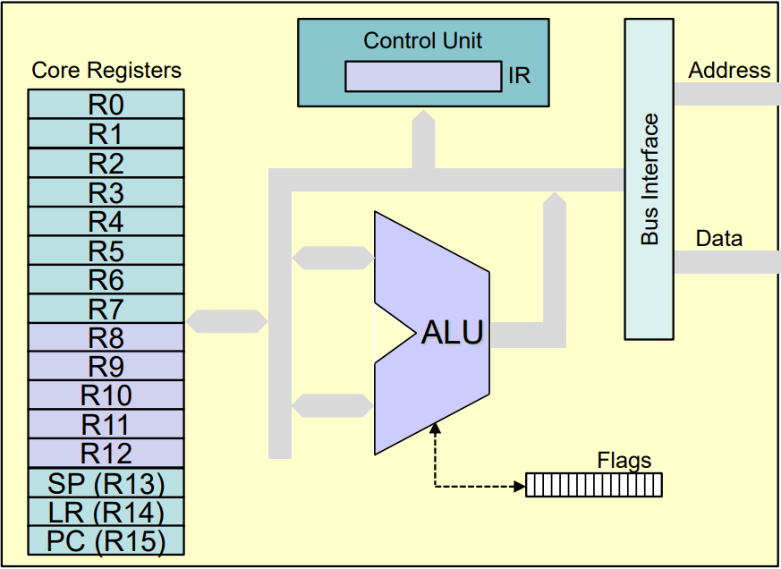
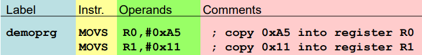
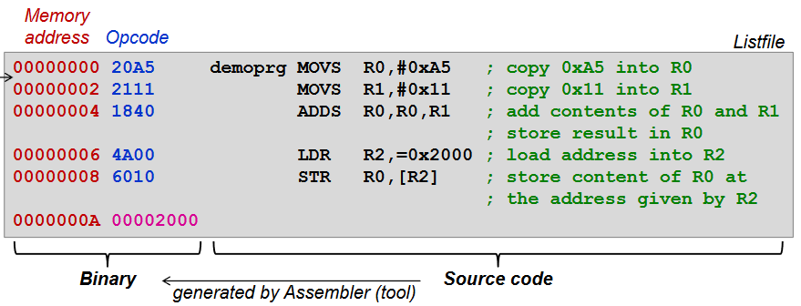
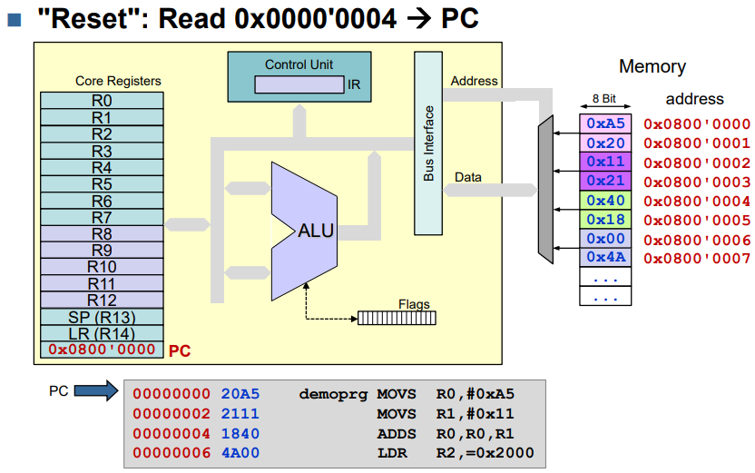
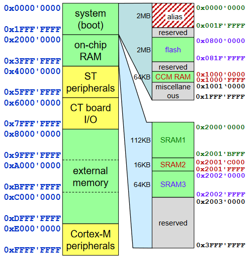
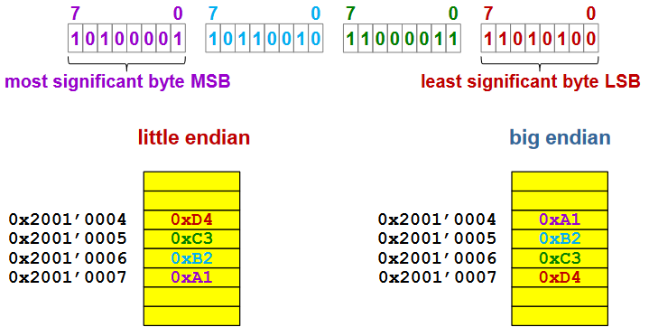
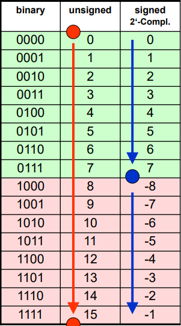
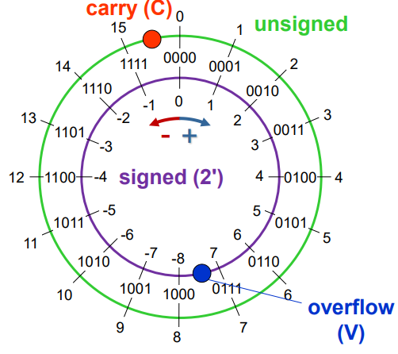
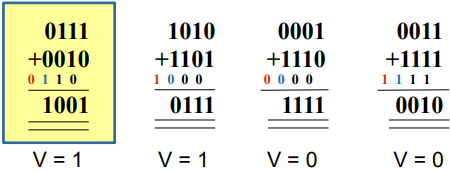

# Cortex-M Architecture

## CPU Model



* 16 Core Registers:
  * Each 32-bit wide
  * Low registers: R0-R7 (can be represented with 3 bit)
  * High registers: R8-R12 (can be represented with 4 bit)
  * SP: Stack Pointer: Last-In First-Out temporary data storage
  * LR: Link Register: Return from procedures
  * PC: Program counter: Address of next instruction
* ALU: Arithmetic Logic Unit
  * 32-bit wide (inputs A and B output is C)
* APSR (Flags)
  * Bits set based on results from ALU:
    * N = Negative, Z = Zero, C = Carry, V = Overflow
* Control Unit with IR
  * Machine code (opcode) that is currently executed
* Bus Interface

## Instruction set and programm execution


* The assbemlber converts each human readable Assembly instruction to a 16-bit (2byte) opcode.
  * Because of this the Memory Adress always increments by two. 



The generated Programm then loaded in to the `code area` in memory (RAM) for us the linker puts it at adress **0x0800'0000** and the `PC` loads the start adress of the programm from a specified **starting adress** for us this is **0x0000'0004** and point then to **0x0800'0000**

* Execution of a generall ARM programm.
    * Reset
    * The starting adress of the programm gets loaded over the `adress buss` from `0x0000'0004` ain to the `PC` 
    * It then loads the 2byte instruction in to the `IR` 
    * Before the execution it then increments the `PC = PC + 2`
    * Then the insturction in the Instruction Register `IR` gets executed
    * The process then repeats itself starting at loading the next instruction from the `PC`



## Memory Map


* Adress space = 4GB = 2^32bits
* Ranging from *0x0000'0000* to *0xFFFF'FFFF*
* on-chip RAM:
  * SRAM1 112 Kbyte
  * SRAM2 16 Kbyte
  * SRAM3 64 Kbyte 
* system (boot)
  * Flash storage: place where the programm gets loaded (thats why the programm starts at 0x0000'0800 here the "RAM" BOOT ST ETC takes up space )
* CT Board I/O
  * status of all perpipherial devices on board like led and switches 

## Little and Big Endian
* `Little Endian` = The "least significant byte" gets stored at the lowest adress
* `Big Endian` = The "most significant byte" gets stored at the lowest adress. 
* Example of storing the value **0xA1B2'C3D4**
```
      A1       B2       C3       D4
10100001 10110010 11000011 11010100
```


## Object File Sections
// todo page 47 in ct1_02


# Data Transfer Instructions
* There are 3 different types of data transfer
    1. Register to Register 
    2. Loading Literals (adress from memory)
    3. Loading Data (data from memory)

## MOV
* copy register value to anohter register. 
* High registers (R8-R12) sind möglich
* statusflags do **not** get updated
```
MOV R9 ,  R1 ; kopiere R1 zu R9
MOV R11, R12 ; kopiere R12 zu R11
```
## MOVS (register)
* copy register value to another.
* **Only** low registers (R0-R7)
* Statusflag gets updated
* Only works for 8 bit asignments
```
MOVS R0, R1    ; copy R1 to R0
MOVS R0, #0xFF ; copy #FF to R0
MOVS R0, #255  ; copy 255 to R0

MY_CONST EQU 0x12 ; muss <= 8 bit sein
MOVS R0, #MY_CONST 
```
## LDR loading literals
* indirect access relative to PC
* PC offset \<imm>
* if Pc not word-aligned align on upper word access
* The opcode of `LDR R1 [PC,#4]` is located between the Adress `0x2000'0000`
to `0x2000'0001` so the `PC` points to `0x2000'0002`.\
Because this adress isn't devidable by 4 it's changed to `0x0200'0004`
* From there on 4 is added 

### load litrals without PC
* In this case the assembler calculates the offset. 
```
00000018 4B01           LDR R3,myLit ; hier wird der Offset zur Adresse 0x0000'0020 automatisch berechnet
...
00000020 12345678 myLit DCD 0x12345678
00000024 9ABCDEF0       DCD 0x9ABCDEF0
```
* Here with pseudo-instructions:  (assembler converts them to something like `LDR R0,[PC,#0x04]`)
```
LDR R0,=var         ; load address which points to var
LDR R0,=MY_CONSTANT ; load MY_CONSTANT into register R0
LDR R0,=0xFFF       ; load hex value into register R0
LDR R0,=4095        ; load integer value into register R0
```
### Load data from Memory
* `LDR`: Load one word (4byte)
* `LDRH`: Load only one half-word (2byte)
* `LDRB`: Load only one byte
```
LDR R1, [R0]      ; load data from address in register R0 into register R1
LDR R1, [R0,#4]   ; address offset of 4 bytes
LDR R1, [R0,#0x4] ; address offset of 4 bytes written in hex
LDR R1, [R0,R2]   ; address offset read from register R2
```

## STR (storing data)
* indirect adressing with immediate offset
  * Offset range 0-124d (0x7C)
* **Only** low registers
* `STR`: store one word (4 byte)
* `STRH`: store only one half-word (2 byte) 
* `STRB`: Store only one byte 

```
STR R1, [R0]      ; store R1 at address from register R0
STR R1, [R0,#0x4] ; address offset of 4 bytes in hex
STR R1, [R0,#4]   ; address offset of 4 bytes as integer
STR R1, [R0,R2]   ; address offset read from register R2
```

## EQU
* symbolic definition of literals and constants
* Doesn't need to be defined in a specific `area`
```
MY_CONST EQU 0xE ; hex number
MY_CONST EQU 15  ; normal number
``` 

## NOP
No operation does litteraly nothing

# Array
* array in assembly: 
```
byte_array
        DCB     0xAA, 0xBB, 0xCC, 0xDD
        DCB     0xEE, 0xFF

// accessing the array
            ...
            MOVS    R0,#0X12    // Load value
            LDR     R1,adr_b    // get addres of array start
            STRB    R0,[R1,#3]  // Store value on offset #3 (args[3])
            ...
adr_b       DCD     byte_array
```
* Same in C
```C
static unit8_t byte_array[] = 
        {0xAA, 0xBB, 0xCC, 0xDD
         0xEE, 0xFF};
```


# Arithmetic Operations 
## Flags
* the Processor doesn't know if you calculate with `signed (V)` or `unsigned (U)` numbers.

```
Flag        Meaning     Action      Operands
Negative    MSB = 1     N = 1       signed
Zero        Reuslt =0   Z = 1       signed, unsigned
Carry       Carry       C = 1       unsigned
Overflow    Overflow    V = 1       signed
```

## ADDS
* adds the content of two registers
* only low registers
* updates flags

```
ADDS    R1,R2,R3    // R3 = R2 + R1
ADDS    R1,R2       // R1 = R1 + R2
ADDS    R1,#4       // R1 = R1 + 4 (#<imm8>)
```

## ADD 
* adds the content of two registers
* high and low registers
```
ADD     R1,R1,R2    // R1 = R1 + R2  (low reg)
ADD     R9,R10      // R9 = R9 + R10 (high reg)
```

## Negative numbers



### negation of a number
* `-a = 0 - a` 
* Wir bilden das 2er Kompliemnt der zahl 
* 2er Kompliment bilden manuell:
  * Mit dem LSB anfangen  (rechts)
  * So lange 0en schreiben bis eine 1 in der Zahl ist
  * Bei der 1 eine 1 schreiben und den rest der Zahl invertieren
* 2er Kompliment bilden manuell 2:
* Zahl invertieren
* \+ 1 rechnen
```
4  = 0100
-4 = 1100
```

## Addition and flags 

### Signed 
* V = 1 indicates overflow
* C irrelevant
  


### Unsigned
* C = 1 indicates overflow
* V irrelevant

```
    1111
  + 0001
    ----
   10000 -> C = 1 
```

## Subtraction and flags
* Subtraction is just addiont with 2nd compliment 

### Signed
* `V = 0 inicates overflow`
* C irrelevant

### Unsigned
* C = 0 inicates borrow 
* V irrelevant 


