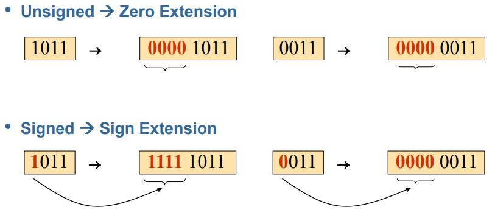
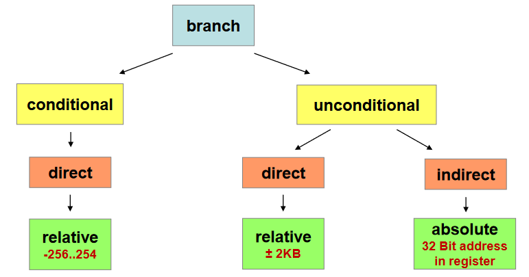
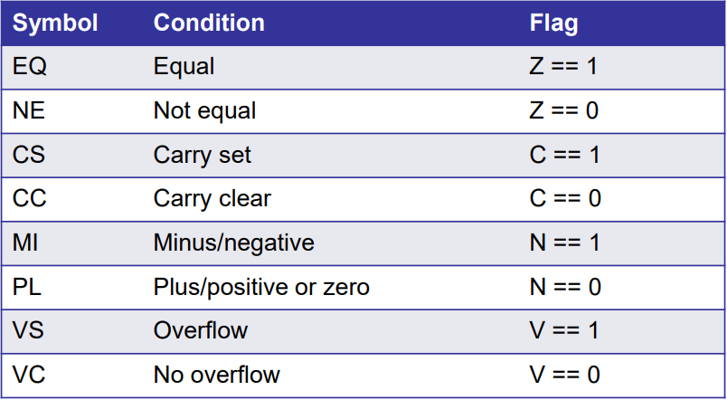
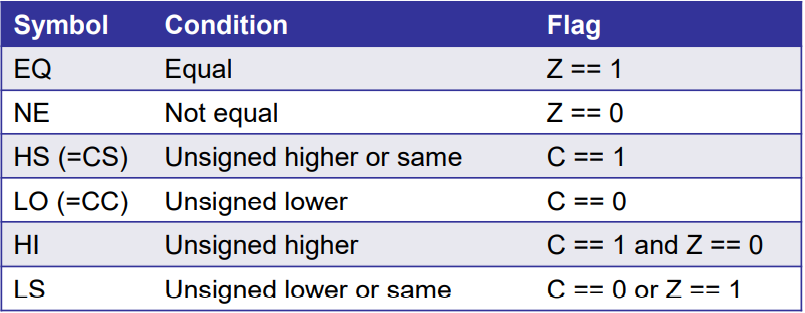
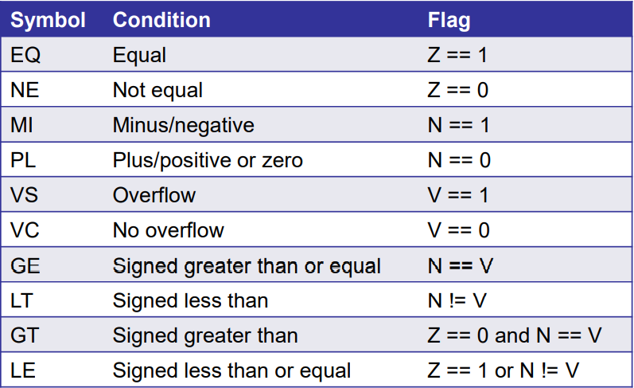
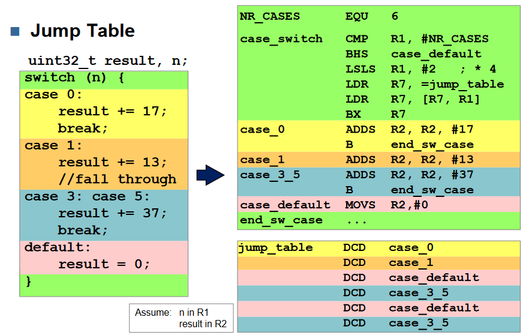
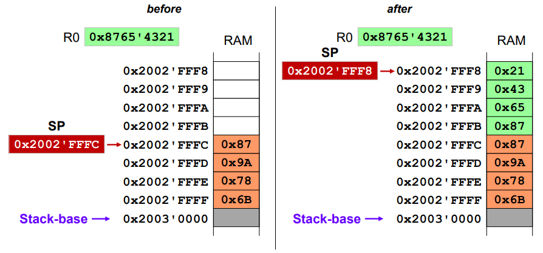
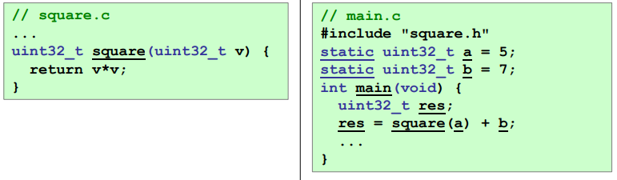
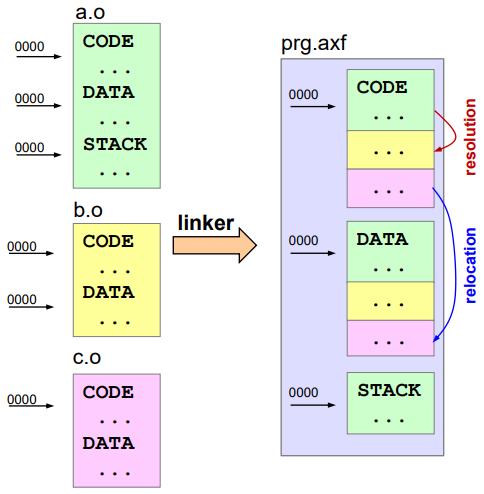

# Cortex-M Architecture

## CPU Model


* 16 Core Registers:
  * Each 32-bit wide
  * Low registers: R0-R7 (can be represented with 3 bit)
  * High registers: R8-R12 (can be represented with 4 bit)
  * SP: Stack Pointer: Last-In First-Out temporary data storage
  * LR: Link Register: Return from procedures
  * PC: Program counter: Address of next instruction
* ALU: Arithmetic Logic Unit
  * 32-bit wide (inputs A and B output is C)
* APSR (Flags)
  * Bits set based on results from ALU:
    * N = Negative, Z = Zero, C = Carry, V = Overflow
* Control Unit with IR
  * Machine code (opcode) that is currently executed
* Bus Interface

## Instruction set and programm execution


* The assbemlber converts each human readable Assembly instruction to a 16-bit (2byte) opcode.
  * Because of this the Memory Adress always increments by two. 


The generated Programm then loaded in to the `code area` in memory (RAM) for us the linker puts it at adress **0x0800'0000** and the `PC` loads the start adress of the programm from a specified **starting adress** for us this is **0x0000'0004** and point then to **0x0800'0000**

* Execution of a generall ARM programm.
    * Reset
    * The starting adress of the programm gets loaded over the `adress buss` from `0x0000'0004` ain to the `PC` 
    * It then loads the 2byte instruction in to the `IR` 
    * Before the execution it then increments the `PC = PC + 2`
    * Then the insturction in the Instruction Register `IR` gets executed
    * The process then repeats itself starting at loading the next instruction from the `PC`


## Memory Map


* Adress space = 4GB = 2^32bits
* Ranging from *0x0000'0000* to *0xFFFF'FFFF*
* on-chip RAM:
  * SRAM1 112 Kbyte
  * SRAM2 16 Kbyte
  * SRAM3 64 Kbyte 
* system (boot)
  * Flash storage: place where the programm gets loaded (thats why the programm starts at 0x0000'0800 here the "RAM" BOOT ST ETC takes up space )
* CT Board I/O
  * status of all perpipherial devices on board like led and switches 

## Little and Big Endian
* `Little Endian` = The "least significant byte" gets stored at the lowest adress
* `Big Endian` = The "most significant byte" gets stored at the lowest adress. 
* Example of storing the value **0xA1B2'C3D4**
```
      A1       B2       C3       D4
10100001 10110010 11000011 11010100
```


## Object File Sections
// todo page 47 in ct1_02


# Data Transfer Instructions
* There are 3 different types of data transfer
    1. Register to Register 
    2. Loading Literals (adress from memory)
    3. Loading Data (data from memory)

## MOV
* copy register value to anohter register. 
* High registers (R8-R12) sind möglich
* statusflags do **not** get updated
```
MOV R9 ,  R1 ; kopiere R1 zu R9
MOV R11, R12 ; kopiere R12 zu R11
```
## MOVS (register)
* copy register value to another.
* **Only** low registers (R0-R7)
* Statusflag gets updated
* Only works for 8 bit asignments
```
MOVS R0, R1    ; copy R1 to R0
MOVS R0, #0xFF ; copy #FF to R0
MOVS R0, #255  ; copy 255 to R0

MY_CONST EQU 0x12 ; muss <= 8 bit sein
MOVS R0, #MY_CONST 
```
## LDR loading literals
* indirect access relative to PC
* PC offset \<imm>
* if Pc not word-aligned align on upper word access
* The opcode of `LDR R1 [PC,#4]` is located between the Adress `0x2000'0000`
to `0x2000'0001` so the `PC` points to `0x2000'0002`.\
Because this adress isn't devidable by 4 it's changed to `0x0200'0004`
* From there on 4 is added 

### load litrals without PC
* In this case the assembler calculates the offset. 
```
00000018 4B01           LDR R3,myLit ; hier wird der Offset zur Adresse 0x0000'0020 automatisch berechnet
...
00000020 12345678 myLit DCD 0x12345678
00000024 9ABCDEF0       DCD 0x9ABCDEF0
```
* Here with pseudo-instructions:  (assembler converts them to something like `LDR R0,[PC,#0x04]`)
```
LDR R0,=var         ; load address which points to var
LDR R0,=MY_CONSTANT ; load MY_CONSTANT into register R0
LDR R0,=0xFFF       ; load hex value into register R0
LDR R0,=4095        ; load integer value into register R0
```
### Load data from Memory
* `LDR`: Load one word (4byte)
* `LDRH`: Load only one half-word (2byte)
* `LDRB`: Load only one byte
```
LDR R1, [R0]      ; load data from address in register R0 into register R1
LDR R1, [R0,#4]   ; address offset of 4 bytes
LDR R1, [R0,#0x4] ; address offset of 4 bytes written in hex
LDR R1, [R0,R2]   ; address offset read from register R2
```

## STR (storing data)
* indirect adressing with immediate offset
  * Offset range 0-124d (0x7C)
* **Only** low registers
* `STR`: store one word (4 byte)
* `STRH`: store only one half-word (2 byte) 
* `STRB`: Store only one byte 

```
STR R1, [R0]      ; store R1 at address from register R0
STR R1, [R0,#0x4] ; address offset of 4 bytes in hex
STR R1, [R0,#4]   ; address offset of 4 bytes as integer
STR R1, [R0,R2]   ; address offset read from register R2
```

## EQU
* symbolic definition of literals and constants
* Doesn't need to be defined in a specific `area`
```
MY_CONST EQU 0xE ; hex number
MY_CONST EQU 15  ; normal number
``` 

## NOP
No operation does litteraly nothing

# Array
* array in assembly: 
```
byte_array
        DCB     0xAA, 0xBB, 0xCC, 0xDD
        DCB     0xEE, 0xFF

// accessing the array
            ...
            MOVS    R0,#0X12    // Load value
            LDR     R1,adr_b    // get addres of array start
            STRB    R0,[R1,#3]  // Store value on offset #3 (args[3])
            ...
adr_b       DCD     byte_array
```
* Same in C
```C
static unit8_t byte_array[] = 
        {0xAA, 0xBB, 0xCC, 0xDD
         0xEE, 0xFF};
```


# Arithmetic Operations 
## Flags
* the Processor doesn't know if you calculate with `signed (V)` or `unsigned (U)` numbers.

```
Flag        Meaning     Action      Operands
Negative    MSB = 1     N = 1       signed
Zero        Reuslt =0   Z = 1       signed, unsigned
Carry       Carry       C = 1       unsigned
Overflow    Overflow    V = 1       signed
```

## ADDS
* adds the content of two registers
* only low registers
* updates flags

```
ADDS    R1,R2,R3    // R3 = R2 + R1
ADDS    R1,R2       // R1 = R1 + R2
ADDS    R1,#4       // R1 = R1 + 4 (#<imm8>)
```

## ADD 
* adds the content of two registers
* high and low registers
```
ADD     R1,R1,R2    // R1 = R1 + R2  (low reg)
ADD     R9,R10      // R9 = R9 + R10 (high reg)
```

## Negative numbers


### negation of a number
* `-a = 0 - a` 
* Wir bilden das 2er Kompliemnt der zahl 
* 2er Kompliment bilden manuell:
  * Mit dem LSB anfangen  (rechts)
  * So lange 0en schreiben bis eine 1 in der Zahl ist
  * Bei der 1 eine 1 schreiben und den rest der Zahl invertieren
* 2er Kompliment bilden manuell 2:
* Zahl invertieren
* \+ 1 rechnen
```
4  = 0100
-4 = 1100
```

## Addition and flags 

### Signed 
* V = 1 indicates overflow
* C irrelevant 
* Wenn wir also 6 + 1 `V = 0 ` **4 bit zahl! 0 -> 7 & -8 -> -1**
* Wenn wir aber 6 + 14 `V = 1` **4 bit zahl! 0 -> 7 & -8 -> -1**
  


### Unsigned
* C = 1 indicates overflow
* V irrelevant
* Wenn wir also 6+2 `C = 0` **4 bit zahl! 0->15**
* Wenn wir also 6 + 12 `C = 1` **4 bit zahl! 0->15**


## SUBS Subtraction and flags 
* Subtraction is just addiont with 2nd compliment 

### Signed
* `V = 0 inicates overflow`
* C irrelevant
* Wenn wir also 6-4 `V = 0` **4 bit zahl! 0 -> 7 & -8 -> -1**
* Wenn wir also 6-14 `V = 1` **4 bit zahl! 0 -> 7 & -8 -> -1**

### Unsigned
* C = 0 inicates borrow 
* V irrelevant 
* Wenn wir also 6-4 dann `C = 1`  **4 bit zahl! 0->15** // kein underflow 
* Wenn wir aber 6-14 dann `C = 0` **4 bit zahl! 0->15** // underflow

# Integer Casting
## Sign extension 4 -> 8bit


## SXTB / SXTH (signed values)
* `SXTB`    Extends an 8-bit value to 32-bit value
* `SXTH`    Extends an 16-bit value to 32-bit value
```
SXTB    R3,R10  // extract the lowest byte of the value in R10 and sign extend it to R3
SXTH    R2,R3   // extract the lower two bytes of the value in R3 and sign extend it to R2
```
## UXTB / UXTH (unsigned values)
* `UXTB`    Extends an 8-bit value to a 32-bit value
* `UXTH`    Extends a 16-bit value to a 32-bit value

# Logic and Shift/Rotate
```
ANDS        AND
BICS        Bit Clear
EORS        XOR
MVNS        NOT
ORRS        OR
```

## LSLS ASRS
* left shift 
* divides/multiplys by 2^n

### Multiply signed & unsigned
```
LSLS R0,R1,#1   // 
```
### Divide by 2^n 
``` 
signed                      unsigned
LSRS R0,R1,#1 // (/2)       ASRS R0,R1,#1 // (/2)
LSRS R0,R1,#2 // (/4)       ASRS R0,R1,#2 // (/4)
```

# Branch Instructions 
* Branches **may** change the PC
* non-linear execution of programms. 


# Unconditional Branches
* Bnach always 

## B (immediate)
* Unconditional 
* Direct  (target adress part of instruction)
* Relative to `PC`
  * imm11:0
  * Offsets from -2048d to 2046d

``` 
00000002 2112 back    MOVS R1,#0x12
00000004 2029         MOVS R0,#0x29
00000006 E003         B forward       ; jump to forward
00000008 BF00         NOP
0000000A BF00         NOP
0000000C BF00         NOP
0000000E BF00         NOP
00000010 1A09 forward SUBS R1,R1,R0
00000012 E7F6         B back          ; jump to back
```

## BX 
* Unconditional 
* Register Rm holds target
* Indirect (target adress in register)
* Absolute (no back jump)

``` 
00000014 4802         LDR R0,=jmpaddr
00000016 4700         BX R0           ; jump to "jmpaddr"
00000018 BF00         NOP
0000001A BF00         NOP
0000001C 3013 jmpaddr ADDS R0,R0,#0x13
0000001E BF00         NOP
```

## Conditional Branches
* Branch only if condition is met
* Flag-dependent branches
  * `unsigned` operations
    * higher and lower
  * `signed` operations
    * greater and less 

### Flag-dependent


### Arithmetic - **unsigned**

 

### Arithmetic - **Signed**



## B\<c\> label
* conditional can be set to something from above E.g.`BEQ`

## CMP
* Gleich wie `SUBS` aber ohne Resultat zu speichern. 

```
CMP R0,R1
BEQ jump ; R0 == R1 (unsigned)
BNE jump ; R0 != R1 (unsigned)
BHS jump ; R0 >= R1 (unsigned)
BLO jump ; R0 <  R1 (unsigned)
BHI jump ; R0 >  R1 (unsigned)
BLS jump ; R0 <= R1 (unsigned)
```

## 
* Gleich wie `ADDS` aber ohne das Resultat zu speichern. 
```
CMN R0,R1
BEQ jump ; R0 == -R1 (unsigned)
BNE jump ; R0 != -R1 (unsigned)
BHS jump ; R0 >= -R1 (unsigned)
BLO jump ; R0 <  -R1 (unsigned)
BHI jump ; R0 >  -R1 (unsigned)
BLS jump ; R0 <= -R1 (unsigned)
```

## TST
* Testet ob ein spezifisches bit gestzt ist. 
* Wie `AND` aber ohne das Resultat zu speichern.
```
S3_MASK EQU 0x00000008    ; 00001000
        LDR R2,=S3_MASK
        LDR R1,=SWITCH_ADDRESS
        LDR R0,[R1] 
        TST R0,R2         ; bit S3 = 1 in R0
        BNE s3_equal_one  ; branch if Z = 0
```

# Programm structures and control structures

## if-then-else
* Beispiel: `if (R1 >= 0) { ... } els e{ ... }` mit R1 signed
 ```
        CMP R1,#0x0
        BLT else    // signed less than
        ...
        B end_if
else
    ...
end_if
```

## Do-while
* Beispiel: do {} while {R1 < 100}
```
loop
    CMP R1,#100
    BLT loop    // if R1 < 100 go to loop
```

## For loop
* Foor Loops are converted into While loops.
* Beispiel for `(int i = 0; i < 100; i++){ ... }`

```
    MOVS R4,#100   // amount itterations
    MOVS R3,#0     
loop 
    CMP R3,R4
    GEQ end     // end loop 
    ADDS R3,#1  // increment counter
    ... / do shit
    B loop
end
```

## Switch case
 

# DCD/DCB/DCW

# Subroutines and Stack 
* Terms used by ARM
  * Routine, subroutine
    * A fragment of program to which control can be transferred that, on completing its taks, returns control to its caller at an instruction following the call. *Routine*
    * is used for clarity where there are nested calls: a routine is the *caller* and a subroutine is the *callee*. 
  * Procedure 
    * A routine that returns no value (void).
  * Function
    * A routine that returns a result value.

## Aufruf mehrere Funktionen Subroutinen
* `BL <label>` call of a subroutine
  * Store current PC in LR
* `BL LR` return from a subroutine 
* `BLX` store current PC in LR

``` 
ADDR_LED_31_0   EQU 0x60000100
LED_PATTERN     EQU 0xA55A5AA5

subrExample     PUSH {R4,R5,LR}

                LDR R4,=ADDR_LED_31_0
                LDR R5,=LED_PATTERN
                STR R5,[R4]

                BL write7seg ; aufruf einer subroutine in subroutine

                POP {R4,R5,PC} ; durch das POP wird direkt der PC wieder hergestellt, heisst der return passiert automatisch kein BX LR nötig
```

## Stack
* FIFO
* `PUSH()` pushes low Registers and R14 (`LR`)
  *  **no other** higher registers
  *  Lowest register stored first **The first one to get poped so at the top**
* `POP()` pops low registers  
  * and`PC` (R15) exclusivly
  * lowest register reloaded first
* `Stack Area` continous are of RAM
* `Stack-base` pointer to the begining of the stack
* `Stackpointer SP` points to the last writen data value

At the begining the Processor fetches initial value of `SP` (now stackbase) at reset  
from address `0x0000'0000`\
Stack base is right above the stack area thus the `SP` is decremented before writing the first word.\
Example: `PUSH {R0}`
 

### Save LR on Stack
```
subrExample     PUSH {R4,R5,LR}
                ; write pattern to LED's
                ...
                BL  write7seg       // cal another subroutine

                POP {R4,R5,LR}
```
### add and subtract from SP 
* immediate offste \<imm>
* offset range 0-1020d and 0-508d respectively  
  
**`PUSH {R2,R3,R6}`**
```
00000000    B083    SUB SP,SP,#12   //Because it points to the top
00000002    9200    STR R2,[SP]
00000004    9301    STR R3,[SP,#4]
00000006    9602    STR R4,[SP,#8]
```

**`POP {R2,R3,R6}`**
```
00000008    9A00    LDR R2,[SP]
0000000A    9B01    LDR R3,[SP,#4]
0000000C    9B02    LDR R6,[SP,#8]
0000000E    B003    ADD SP,SP,#12
```
# Parameter passing 
# Modular coding Linking

## `.h` file
* definition of the module interface
  * `Declares` what functionality is available to the client of the code

**utils_ctboard.h**
```C
#ifndef _UTILS_CTBOARD
#define _UTILS_CTBOARD

#include <stdint.h>

/*
* Some comment 
*/
uint8_t  read_byte(uint32_t address);
uint16_t read_halfword(uint32_t address);
uint32_t read_word(uint32_t address);
uint64_t read_doubleword(uint32_t address);

#endif

```


## `.c` file
* Implementation of module
  * `Defines` gives the function it body
  * Proivdes the fucntionality behind the interface
  * An interface ma have alternative implementations 

**utils_board.c**
```C
#include <stdint.h>
#include "utils_ctboard.h"

/*
 * See header file
 */
uint8_t read_byte(uint32_t address)
{
    uint8_t *pointer;
    pointer = (uint8_t *)address;
    return *pointer;
}
....
```

## `.o` file
**object file**
* Contains all compiled data of module
  * Code section
    * code and constant data of the module, based at adress `0x0`
  * Data section
    * All global variables of the module, based at address `0x0`
  * Symbol table
    * All symbols with their attributes like global/local, reference, etc.
  * Relocation table
    * Which bytes of the data and code section need to be adjusted (and how)\
    after merging the secionts in the linking process

## `.elf` file
**ELF = Executable and Linkable Format**
* Contains all linked data of the program
  * Code section
    * Code and constant data of the program
  * Data section
    * All global variables of the program
      * All symbols with their attributes like global/local etc. 

## external linkage 
squre = external linkage 
 

## Linker 
* Merge object file and `data sections`
  * Place all data sections of the individual objevt files into one data\
    section of the executable file
* Merge object file `code sections`
  * Place all code sections of the individual objevt files into one code\
    section of the executable file
* Resolve used `external symbols`
  * Search missing addresses of used external symbols
* Relocate addresses
  * Adjust used addresses since merging the sections invalidated the\
    original addresses

 